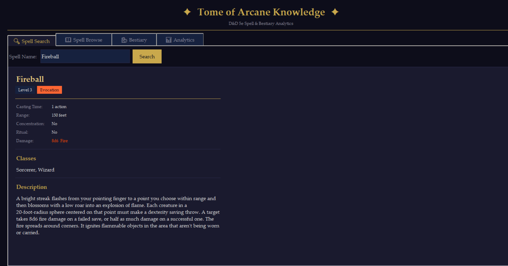

# D&D 5e Spell Analytics Pipeline

An ETL pipeline that extracts all 319 spells from the D&D 5e API, transforms the data, and loads it into a SQLite database for analysis.

Built as a portfolio project to learn data engineering fundamentals — because analyzing magic is more fun than analyzing sales data.

## What it does

- Extracts all spells from the [D&D 5e API](https://www.dnd5eapi.co/)
- Transforms raw JSON into a clean, flat table with derived fields
- Loads into a local SQLite database
- Answers questions like:
  - Which damage type has the most spells?
  - What is the average spell level per school of magic?
  - Which spells are available to the most classes?
  - How does Fire damage scale across spell levels?

## Key findings

- **Fire** dominates with 16 damage spells — more than double any other type
- **Necromancy and Conjuration** are the hardest schools — highest average spell level
- **Divination** skews low — mostly utility spells accessible at early levels
- Only **64 of 319 spells** deal damage — the rest are utility, healing, or control

## Tech stack

- Python 3.14
- pandas — data transformation
- requests — API calls
- SQLite — local database storage

## How to run

1. Clone the repository
2. Install dependencies: `pip install pandas requests matplotlib Pillow`
3. Run the pipeline to fetch and store data: `python pipeline.py`
4. Open the app: `python lookup_app.py``